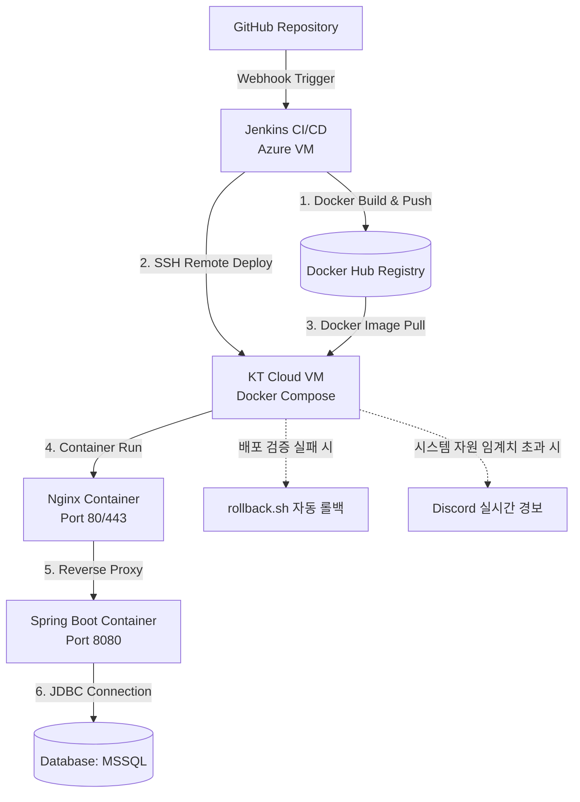
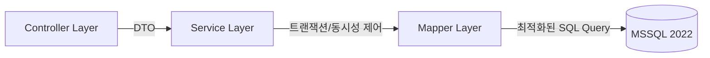

  
# 사원 평가 시스템 (EES)
**대규모 트래픽 환경의 동시성 제어와 CI/CD 무중단 배포를 적용한 엔터프라이즈 백엔드 프로젝트**

 

[**운영 서버 접속 (ees-eval.com)**](https://ees-eval.com/) &nbsp; | &nbsp; [**WBS (일정 관리)**](https://docs.google.com/spreadsheets/d/1ZLVCVKlmdRchz_vIjrUE8szmNvLjTK5t4vgLfzbg3JQ/edit?usp=sharing)

 

---

## 프로젝트 개요
대규모 사원 평가 과정에서 발생하는 **동시성 이슈와 쿼리 지연을 개선**한 백엔드 개발 프로젝트입니다. 평상시에는 트래픽이 적지만, **평가 마감일 직전에 전사 직원이 동시에 몰려 평가서를 제출하는 특성**을 고려하여 아키텍처를 설계했습니다.

* **개발 기간**: 2025.04 ~ 2025.06
* **팀 규모**: 3명 (백엔드 2명, 프론트엔드 1명)
* **운영 환경**: KT Cloud VM, Docker Compose, MSSQL 2022

## 주요 기능 (Core Features)
- **다면 평가 매핑 자동화**: 부서 및 직책 정보를 바탕으로 본인, 1차 평가자, 2차 평가자 등 다단계 평가 관계 자동 생성
- **동시성 제어된 평가 제출**: 평가 마감 직전 다수의 사용자가 동시에 점수를 저장할 때 발생하는 데이터 덮어쓰기 방어
- **관리자 대시보드**: 실시간 평가 진행률 통계 및 최종 등급(S, A, B, C, D) 확정 기능

---

## 시스템 아키텍처 (Architecture)

### 1. 무중단 배포 및 CI/CD 인프라 아키텍처

### 2. 백엔드 논리적 레이어

---

## 인프라 자동화 및 DevOps

### 장애 없는 CI/CD 파이프라인 (Zero-Downtime & Rollback)
- **정밀 헬스체크**: Nginx 리다이렉트(301/302) 및 Spring Boot Actuator 내부 상태(`"status":"UP"`)를 교차 검증합니다.
- **자동 롤백 (Self-Healing)**: 배포 실패 또는 헬스체크 응답 타임아웃 발생 시, 스크립트(`rollback.sh`)가 이전 안정 버전 컨테이너로 즉각 원상 복구하여 가용성을 보장합니다.

### 실시간 관측성 (Observability) 및 알람 생략 로직
- 서버 CPU, 메모리 자원 고갈 시 **Discord Webhook**을 통해 즉각적인 장애 경보를 발송하는 크론 데몬(`ees_monitor.sh`)을 자체 구축했습니다.
- 배포가 진행 중인 짧은(10~20초) 다운타임 구간에는 서버 장애로 **오탐지(False Positive)**하지 않도록 `.deploying` 플래그를 활용한 Mute 로직을 구현했습니다.

---
> *ERD 등 상세한 데이터베이스 DDL 스크립트는 최상단 `ERD.sql` 파일을 참고해 주세요.*
