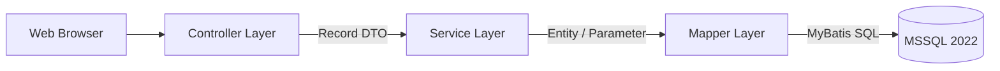

# EES (Employee Evaluation System)
사내 평가 마감 시점의 동시 제출 경합 제어와 대량 매핑 I/O 최적화를 구현한 B2B 사원 평가 시스템

<br>


---

## 프로젝트 개요
임직원의 정기 및 다면 평가를 진행하고, 인사 부서에서 전체 평가 프로세스를 통제할 수 있는 B2B 사내 평가 시스템입니다. 평상시에는 접속량이 적지만 **평가 마감일 직전에 평가서 제출이 집중되는 특성**을 고려하여 동시성 제어 및 데이터베이스 최적화를 중점적으로 설계했습니다.

- **기간**: 2026.04.10 ~ 2026.06.15 (약 10주)
- **팀**: 2명 (백엔드 기여도 50%)
- **담당 역할**:
  - 다면 평가 매핑 및 상대평가 등급 산정 비즈니스 로직 설계/구현
  - Version 기반 낙관적 락을 통한 동시 수정 충돌 제어
  - MSSQL 필터드/커버링 인덱스 설계 및 대량 매핑 I/O 최적화
  - Testcontainers (MSSQL 2022) 기반 격리 통합 테스트 환경 구축 (총 48개 테스트 케이스)
  - Jenkins & Docker Compose 기반 배포 파이프라인 및 헬스체크/롤백 구축

---

## 주요 기능
- **평가 차수 관리**: 연도별 평가 차수를 오픈하고 `계획(PLANNED) → 진행(IN_PROGRESS) → 마감(CLOSED)` 상태로 프로세스 엄격 통제
- **다면 평가 매핑**: 사원 계층 구조를 기반으로 본인(SELF), 팀장(MANAGER), 임원(EXECUTIVE), 부서원(SUBORDINATE) 다단계 평가 관계 일괄 자동 생성
- **평가 작성 및 제출**: 피평가자별 점수 및 서술형 피드백 작성, 임시저장 및 최종 제출
- **상대평가 등급 산정**: 최대 잔여법(LRM) 기반 소수점 오차 없는 부서별 상대평가 등급(S, A, B, C, D) 산출 및 확정
- **평가 결과 조회**: 최종 확정된 개인별 평가 등급 및 피드백 열람

---

## 기술적 특징
- **대량 평가 매핑 DB I/O 최적화**: 사원 100명 기준 개별 반복 조회를 All-in-one 일괄 조회 및 500건 Chunking Batch Insert로 개선하여 DB I/O 400회 → 6회 감축 (약 98.5% 감소)
- **Version 기반 낙관적 락**: 동일 평가서에 대한 동시 수정 및 중복 클릭(Lost Update) 방어, 충돌 시 500 오류 대신 302 Redirect 및 Flash Message 안내
- **LRM 기반 상대평가**: 최대 잔여법(Largest Remainder Method)을 적용하여 소수점 잔여 인원을 순차 배분함으로써 100% 일치하는 정수 TO 할당 및 동점자 처리 연계
- **MSSQL Testcontainers 통합 테스트**: H2 방언 한계를 극복하고 실제 운영 환경과 동일한 MSSQL 2022 컨테이너 환경에서 총 48개 테스트 케이스 운영

---

## 시스템 아키텍처


```mermaid
graph LR
    Client[Web Browser] --> Controller[Controller Layer]
    Controller -->|Record DTO| Service[Service Layer]
    Service -->|Entity / Parameter| Mapper[Mapper Layer]
    Mapper -->|MyBatis SQL| DB[(MSSQL 2022)]
```

- Controller - Service - ServiceImpl - Mapper 계층 분리를 엄격히 준수하고, Java 21 `Record` 불변 DTO를 활용해 계층 간 데이터 무결성을 보장합니다.

---

## 빠른 시작

별도의 데이터베이스 설치나 Docker 설정 없이, **Java 21 환경에서 명령어 단 한 줄로 즉시 실행**할 수 있습니다. (개발/테스트용 공용 DB 자동 연결)

### 1. 실행 명령어
- **Windows (PowerShell / CMD)**:
  ```powershell
  cd eval
  .\mvnw.cmd spring-boot:run
  # 또는 CMD 환경: mvnw spring-boot:run
  ```
- **Linux / macOS**:
  ```bash
  cd eval
  ./mvnw spring-boot:run
  ```

### 2. 접속 URL 및 테스트 계정
브라우저에서 **`http://localhost:8080`**으로 접속합니다. (기본 리다이렉트 `/login`)

- **인사 관리자 (ROLE_ADMIN)**: `1000` / `admin123`
- **부서장/팀장 (ROLE_MANAGER)**: `1001` / `1234` (김철수 과장 / DX전략팀장)
- **일반 사원 (ROLE_USER)**: `1002` / `1234` (이영희 대리 / 피평가자)
- **임원 (ROLE_EXECUTIVE)**: `1041` / `1234` (본부장DX / 최종확정)
- *(사번 `1001` ~ `1042` 계정의 기본 비밀번호는 모두 `1234`입니다.)*

---

## 테스트

운영 DB와 동일한 환경에서 동작하도록 **Testcontainers 기반 MSSQL 2022 컨테이너**가 자동으로 기동되어 테스트를 수행합니다. (Docker 데몬 필요)

```bash
cd eval
./mvnw test
```
- Controller 슬라이스 테스트, Service 비즈니스 로직 단위 테스트, Mapper 쿼리 슬라이스 테스트 등 **총 48개 테스트 케이스** 검증

---

## 배포
- 프로젝트 진행 당시 **Jenkins + Docker Compose + KT Cloud VM** 기반으로 CI/CD 배포 파이프라인 및 Actuator 헬스체크(`/internal-monitor/health`) 기반 무중단 롤백(`rollback.sh`) 환경을 구축했습니다.
- *(현재 외부 운영 서버는 비용 및 클라우드 리소스 관리 목적으로 중지된 상태이며, 로컬 환경에서 실행 및 테스트 가능합니다.)*

---

## 상세 기술 문서
- 📄 [EES 백엔드 상세 포트폴리오 (Notion)](https://www.notion.so/EES-35d072048a65800f998ce051ccf8a8ff)
- 📊 [WBS 일정 관리 (Google Sheets)](https://docs.google.com/spreadsheets/d/1ZLVCVKlmdRchz_vIjrUE8szmNvLjTK5t4vgLfzbg3JQ/edit?usp=sharing)
